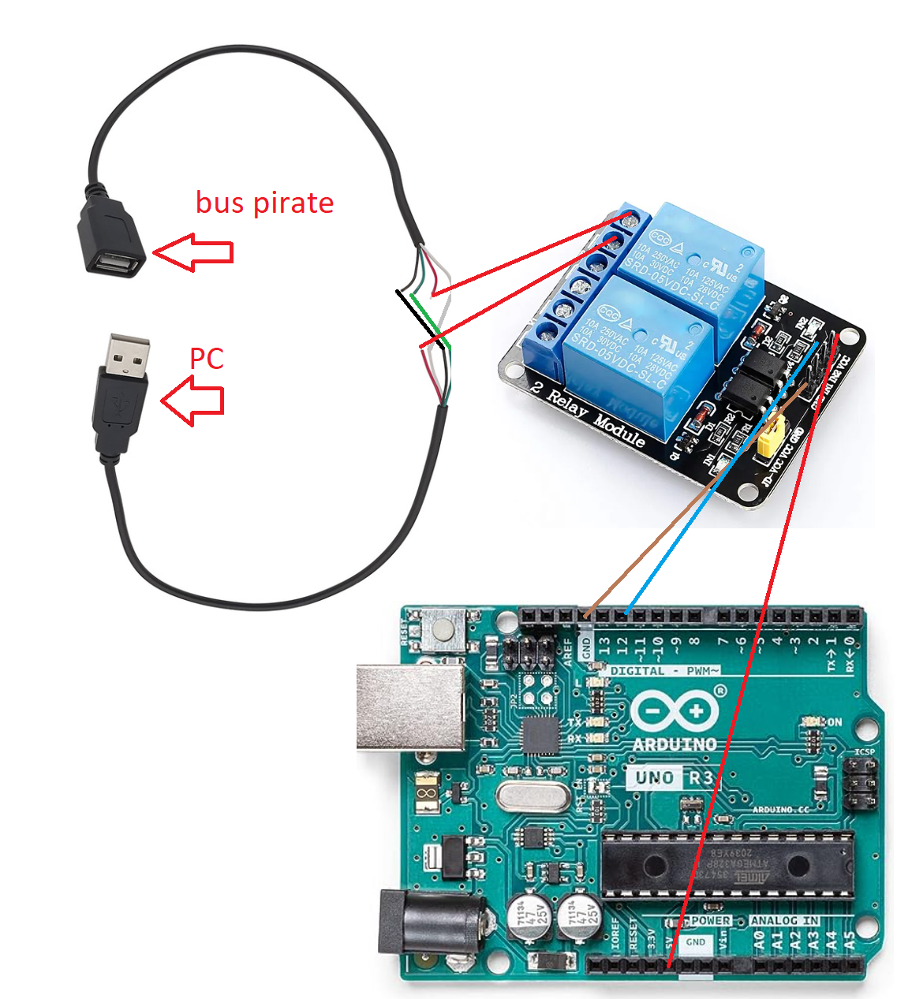
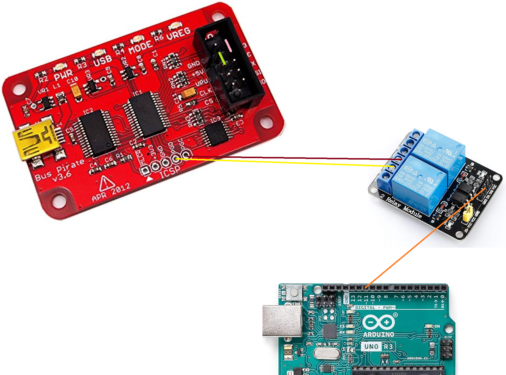
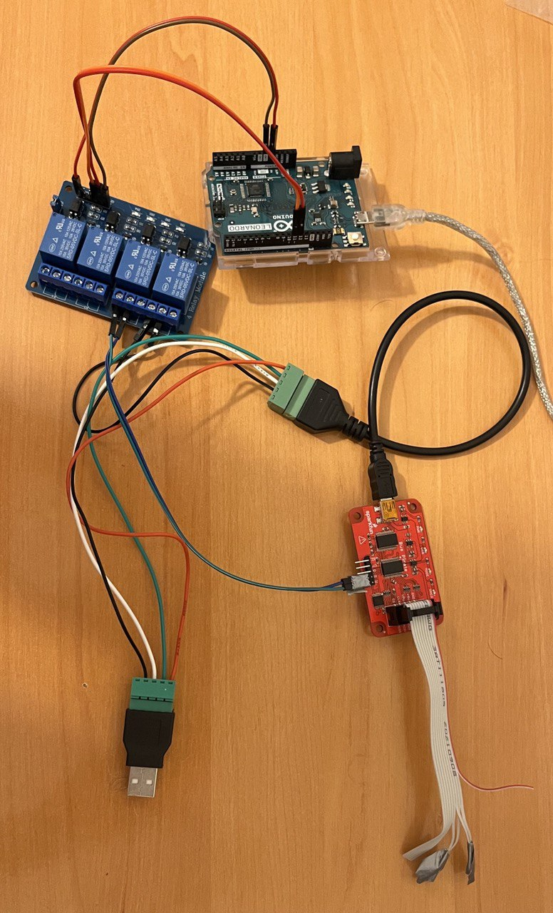
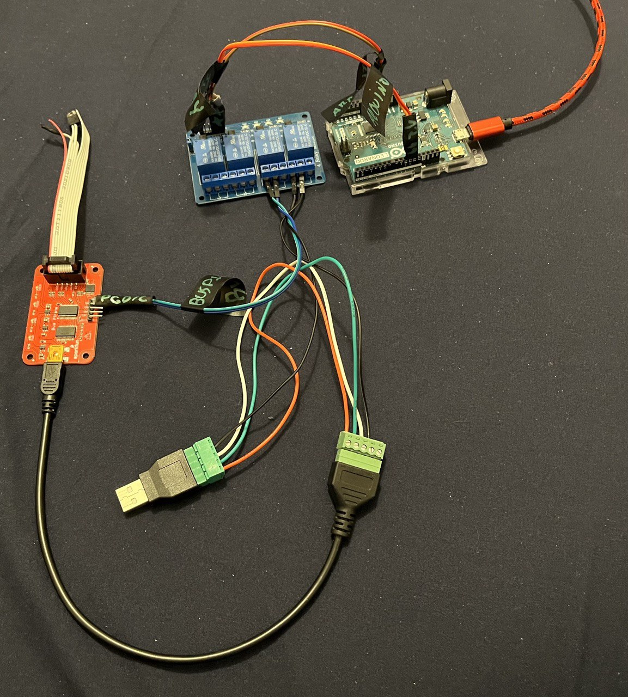
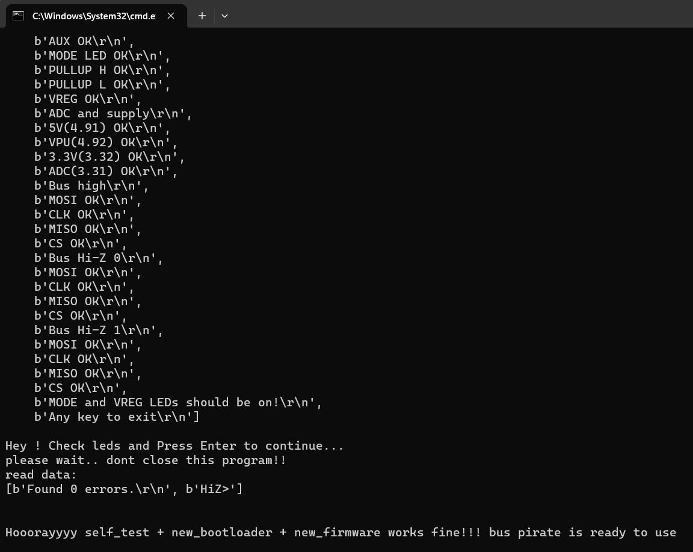

# autobuspirateupgrade
automate bootloader+firmware+update+self_test on bus pirate v3 with arduino and python. Firmware 7.1 bootloader 4.5

**WARNING CHANGE BOOTLOADER CAN BRICK YOUR BUS PIRATE, YOU SHOULD NOT USE THIS PROJECT xD**

VIDEO DEMO:

https://www.youtube.com/watch?v=cnYpEc1Y6F0

**NEVER USE USB-HUBS, CONNECT ALL DIRECTLY TO PC**

# Steps

## First

- buy a usb diy male cable + female usb diy cable
- connect all cables together except VCC (red)
- buy two 5v relay
- connect VCC from both usb to relay
- connect pin 12 from arduino to control this relay
- connect +5v + gdn from arduino to relay

## Two: connect bus pirate

- Connect PGD + PGC to another relay
- connect pin 11 from arduino to control this relay
- with a jumper or two female dupont cables connect:
  - +5v with VPU
  - +3v3 with ADC

## Result

something like this chaos:

## Final steps

- connect arduino to PC via usb cable
- connect bus pirate to PC via frankestein diy-cables
- flash arduinofirm/arduinofirm.ino to your arduino
- install python3 + pip install pyserial
- edit autobuspirateupgrade.py and put your COM for arduino and for bus pirate
- run: python autobuspirateupgrade.py

Done!

# Related & Credits

- http://dangerousprototypes.com/forum/index.php?topic=8498.0

